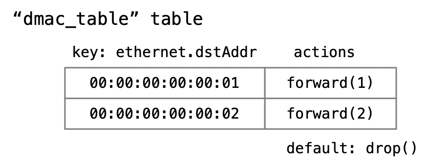

## Tutorial 3: テーブルへのエントリ追加

Tutorial 2 では転送先を決定する処理は P4 プログラム中にすべてハードコードされていました。しかし一般にスイッチやルータは内部に設定された表を調べることによって転送先を決定します。ここではパースして得たMACアドレスによって転送先を決定するスイッチプログラム、tablematch.p4 を試します。

### Match Action Table 設定

P4 には Match Action Table と呼ばれるものがあり、これを使ってパケットごとに必要な処理（アクション）を適用することができます。このチュートリアルでは以下のようなテーブルを用意します。



このテーブルの形式について説明します。変数名や関数名については macaddr.p4 プログラム（後掲）と対照してください。

* テーブル名は "dmac_table" 
* キーとなるフィールドは一つだけ、ethernet.dstAddr 型で用意
* アクション関数には forward( ) あるいは drop( ) を設定する
* 上の図では 00:00:00:00:00:01 (h1) 宛てのパケットは forward(1) を、00:00:00:00:00:02 (h2) 宛ては forward(2) を実行する
* どのキーにもマッチしなかった場合、drop() 関数を実行する

### スイッチプログラムの切り替え

Tutorial 2 で行ったのと同様に、今度は tablematch.p4 プログラムをコンパイルしたスイッチプログラムを Mininet に与えて動かします。コンパイルの手順などは Tutorial 2 の記述を見て下さい。以下は P4Runtime Shell を再起動したところです。

```python
$ docker run -ti -v /tmp/P4runtime-protoswitch:/tmp p4lang/p4runtime-sh --grpc-addr host.docker.internal:50001 --device-id 1 --election-id 0,1 --config /tmp/tablematch_p4info.txtpb,/tmp/tablematch.json
*** Welcome to the IPython shell for P4Runtime ***
P4Runtime sh >>>
```
### テーブル処理

#### 存在するテーブルと、その定義の確認

tables コマンドによってスイッチに存在するテーブル、つまり P4 プログラム中に定義した dmac_table の存在を確認できます。またテーブルを名指しすることで、定義内容の詳細を確認できます。

```c++
P4Runtime sh >>> tables          <<<< 存在するテーブルの一覧を表示
MyIngress.dmac_table             <<<< MyIngress 処理の中に dmac_table が存在する
P4Runtime sh >>> tables["MyIngress.dmac_table"]  <<<< 名指しすると詳細が表示される
Out[5]: 
preamble {
  id: 35550025
  name: "MyIngress.dmac_table"
  alias: "dmac_table"
}
match_fields {
  id: 1
  name: "hdr.ethernet.dstAddr"
  bitwidth: 48
  match_type: EXACT
}
action_refs {
  id: 29683729 ("MyIngress.forward")
}
action_refs {
  id: 25652968 ("MyIngress.drop")
}
initial_default_action {
  action_id: 25652968
}
size: 1024
  
P4Runtime sh >>>
```

#### エントリのインサート

テーブルに対して h1 向けのキーとアクションを設定します。各種のパラメタ（宛先MACアドレス "00:00:00:00:00:01"、アクション関数 forward(1) ）を Table Entry インスタンス（変数名 te）に設定して、te.insert() するだけです。

```python
P4Runtime sh >>> te = table_entry["MyIngress.dmac_table"](action="MyIngress.forward")

P4Runtime sh >>> te.match["hdr.ethernet.dstAddr"] = "00:00:00:00:00:01"  <<<< キーの設定
field_id: 1
exact {
  value: "\001"
}

P4Runtime sh >>> te.action.set(port="1")    <<<< action 関数の port 引数に 1 を設定
param_id: 1
value: "\001"

P4Runtime sh >>> te.insert()                <<<< 完成したテーブルエントリをインサートする

P4Runtime sh >>>
```

[P4Runtime Shell の GitHub リポジトリ](https://github.com/p4lang/p4runtime-shell) には、こうしたテーブル操作などのサンプルがあります。見ると良いでしょう。

##### ちょっと違う書き方

なお、一行目の te インスタンスを作る時にアクション関数を forward( ) にあらかじめ指定してから、キー（MACアドレス）と、そのアクション関数のパラメタ（ポート番号 1）を設定しています。キー、アクション関数、パラメタ、の順で設定したほうが分かりやすいという人は以下のような書き方も可能です。

```python
te = table_entry["MyIngress.dmac_table"]()
te.match["hdr.ethernet.dstAddr"] = "00:00:00:00:00:01"
te.action = Action("MyIngress.forward")
te.action.set(port="1")
te.insert()
```

つまり一行目の末尾で (action="forward") と指定しているのは、にアクション関数インスタンスを自動的に作って te.action にセットさせているのですね。

#### テーブルの内容表示

インサートに成功したら、テーブルの内容を確認しましょう。

```python
P4Runtime sh >>> table_entry["MyIngress.dmac_table"].read(lambda te: print(te))
table_id: 35550025 ("MyIngress.dmac_table")
match {
  field_id: 1 ("hdr.ethernet.dstAddr")
  exact {
    value: "\\x01"
  }
}
action {
  action {
    action_id: 29683729 ("MyIngress.forward")
    params {
      param_id: 1 ("port")
      value: "\\x01"
    }
  }
}

P4Runtime sh >>>
```

続いて同様の操作で h2 向けのエントリも追加し、その中身を確認してください。問題なくエントリが二つ設定できたら、次の通信実験に進みましょう。

### 通信実験

Mininet 側で以下のようにして h1 から h2 あるいは h3 に向けて ping を掛けてみましょう。

```bash
mininet> h1 ping -c 1 h2　　　　　　　　                       <<<< h1 -> h2 宛て
PING 10.0.0.2 (10.0.0.2) 56(84) bytes of data.
64 bytes from 10.0.0.2: icmp_seq=1 ttl=64 time=7.24 ms      <<<< 返事がきた

--- 10.0.0.2 ping statistics ---
1 packets transmitted, 1 received, 0% packet loss, time 0ms
rtt min/avg/max/mdev = 7.242/7.242/7.242/0.000 ms
mininet> h1 ping -c 1 h3　　　　　　　　                       <<<< h1 -> h3 宛て
PING 10.0.0.3 (10.0.0.3) 56(84) bytes of data.
^C                                                   <<<< 返事が無いので Control-C で中断
--- 10.0.0.3 ping statistics ---
1 packets transmitted, 0 received, 100% packet loss, time 0ms

mininet> 
```

ログファルを調べてみると、正しく転送されていることが観察できると思います。もちろん、テーブルに h3 用のエントリを追加すると h1 -> h3 の ping が通るようになります。

### tablematch.p4 プログラムの内容

このようなパケットの転送が行われたのは、Mininet のスイッチに送り込まれたスイッチプログラムにそのようなパケット制御が書かれているからです。P4プログラムの内容を確認しましょう。

#### テーブル定義

Ingress 処理段階で呼ばれる MyIngress( ) 関数の中にテーブル処理関連の記述（関数とテーブルの定義）が含まれています。以下に抜粋します。

```c++
    action forward(egressSpec_t port) {          <<<< アクション関数 forward( ) の定義
        standard_metadata.egress_spec = port;    <<<< 与えられた引数 port を出力先に設定
    }
    action drop() {                              <<<< アクション関数 drop( ) の定義
        mark_to_drop(standard_metadata);         <<<< drop指定をする（どこにも出力されない）
    }
    
    table dmac_table {                     <<<< テーブル "dmac_table" の定義
        key = {
            hdr.ethernet.dstAddr : exact;  <<<< キーはこの ethernet.dstAddr フィールドだけ
        }
        actions = {                        <<<< action 関数として指定可能なのはこの二つ
            forward;
            drop;
        }
        size = 1024;
        default_action = drop();           <<<< デフォルトは drop( )
    }
```

このプログラムでは、上のテーブル関連記述は MyIngress( ) の大半を占めます。MyIngress( ) の実質的な実行記述は以下のように apply { } だけで、その中はいま定義したテーブル dmac_table に対して apply( ) 関数を呼び出すだけです。もしこの呼び出し記述がなく、テーブルを定義しただけではパケットのマッチ・アクション処理は起きません。

```c++
control MyIngress(inout headers hdr, inout metadata meta,
                    inout standard_metadata_t standard_metadata) {

    ### 上に抜粋したテーブル関連の定義
    
    apply {    <<<< MyIngress( ) 処理の実質的な実行開始場所（テーブル定義記述の一部ではない）
        dmac_table.apply();  <<<< dmac_table に対して入力パケットをマッチさせる、という意味
    }
}
```

### 参考：エントリの削除

以下のようにして登録されているエントリをすべて表示することができていました。
```bash
P4Runtime sh >>> table_entry["MyIngress.dmac_table"].read(lambda a: print(a))
```
同様に以下のようにして登録したエントリをすべて削除することができます。
```bash
P4Runtime sh >>> table_entry["MyIngress.dmac_table"].read(lambda a: a.delete())
```


これで一連のチュートリアルが完了しました。お疲れさまでした。

## Next Step

次は[ここ](README.md#next-step)でしょうか。

