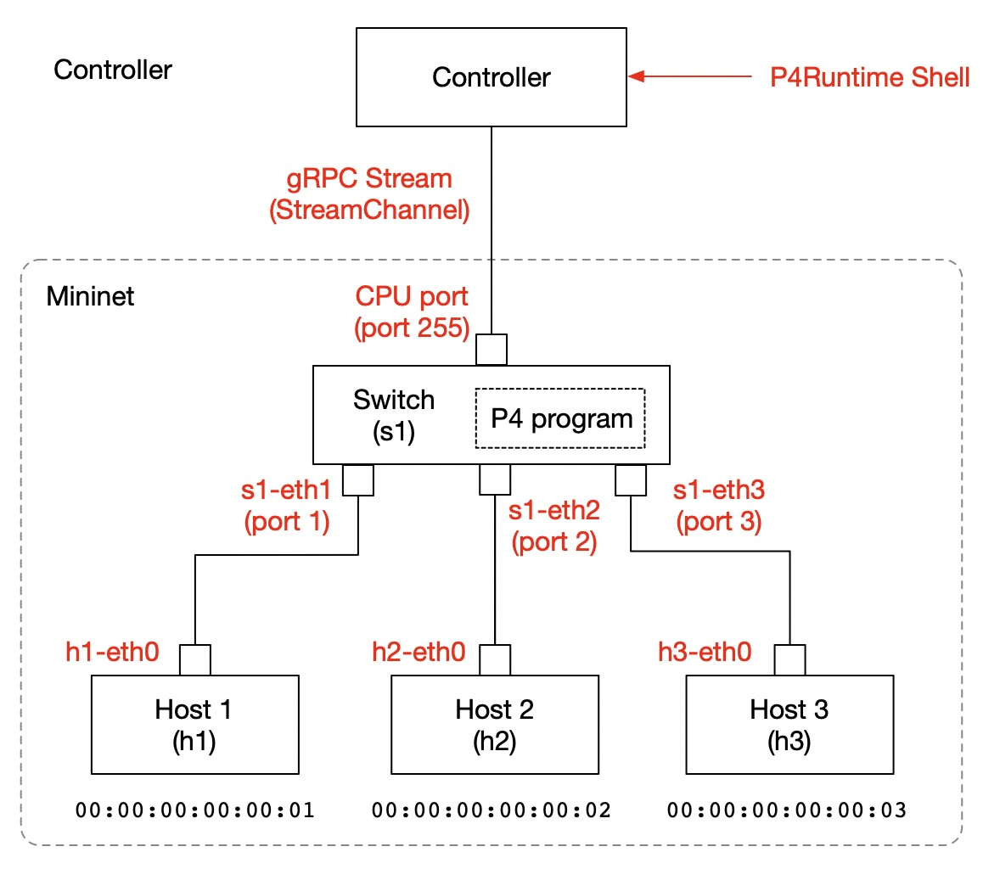

## Tutorial 0: Preparation of the Experimental Environment

Before starting the experiments, you need to compile the P4 switch program. Using that, you will start Mininet and connect the P4Runtime Shell, which acts as the controller.

### Compiling the P4 Program

#### Creating a workspace and copying files

Create a working directory `/tmp/P4Runtime-protoswitch` and copy the P4 programs in this tutorial into it.

```bash
$ mkdir /tmp/P4Runtime-protoswitch
$ cp port2port.p4 macaddr.p4 tablematch.p4 /tmp/P4Runtime-protoswitch
$ ls /tmp/P4Runtime-protoswitch
macaddr.p4	port2port.p4	tablematch.p4
$
```

#### Starting the P4C container

Start the P4C Docker container as follows:

```bash
$ docker run -it -v /tmp/P4Runtime-protoswitch/:/tmp/ p4lang/p4c:1.2.5.6 /bin/bash
root@897ac728fb57:/p4c#
```

##### Note for ARM Mac

If you see an error such as **"no matching manifest for linux/arm64/v8 in the manifest list entries"**, you are likely using a Mac with an ARM processor.

```bash
$ docker run -it -v /tmp/P4Runtime-protoswitch/:/tmp/ p4lang/p4c:1.2.5.6 /bin/bash
Unable to find image 'p4lang/p4c:1.2.5.6' locally
latest: Pulling from p4lang/p4c
docker: no matching manifest for linux/arm64/v8 in the manifest list entries
$
```

To run P4C (and P4Runtime Shell) on an ARM Mac, you currently need to enable Rosetta. In Docker Desktop settings → General → Virtual Machine Options, enable “Use Rosetta for x86_64/amd64 emulation on Apple Silicon”. Then add the platform option to the docker command like:

```bash
$ docker run --platform=linux/amd64 ...
```

#### Compiling with P4C

Note that the host directory `/tmp/P4Runtime-protoswitch` is synchronized with `/tmp` inside the container.

From the p4c container, the files should be visible under `/tmp`. Compile `port2port.p4` as follows:

```bash
root@897ac728fb57:/p4c# pwd
/p4c
root@897ac728fb57:/p4c# cd /tmp
root@897ac728fb57:/tmp# ls
macaddr.p4  port2port.p4  tablematch.p4
root@7131e7655bba:/tmp# p4c --target bmv2 --arch v1model --p4runtime-files port2port_p4info.txtpb port2port.p4
root@7131e7655bba:/tmp# ls
macaddr.p4  port2port.json  port2port.p4  port2port.p4i  port2port_p4info.txtpb  tablematch.p4
root@7131e7655bba:/tmp#
```

You will later use the generated `port2port_p4info.txtpb` and `port2port.json` to start the P4Runtime Shell.

##### Why tag 1.2.5.6 is specified

Instead of using the latest image, tag `1.2.5.6` is explicitly specified. This is because the latest version currently produces an error like:

```bash
/usr/local/bin/p4c-bm2-ss: error while loading shared libraries: libboost_iostreams.so.1.71.0: cannot open shared object file
```

It seems that around version 1.2.5.7 (Jun 4, 2025), some required libraries were removed. As a workaround, you can install libboost manually:

```bash
# apt update
# apt install -y libboost-iostreams1.71.0
```

### System Configuration

The system configuration is as follows. A 3-port switch is created in Mininet, and P4Runtime Shell is used as the controller.



P4Runtime connects the controller and switch via gRPC. At Mininet startup, a TCP port (50001) is specified. When starting P4Runtime Shell, specify the IP address and port of the Mininet environment. When started, the P4Runtime Shell installs the P4 program specified at startup onto the switch via the gRPC connection.

### Starting Mininet

Here, we use the [P4Runtime-enabled Mininet Docker Image](https://hub.docker.com/repository/docker/yutakayasuda/p4mn) as the switch. You can start it as follows.

Start a P4Runtime-enabled Mininet environment in a Docker environment. Note that the `--arp` and `--mac` options are specified at startup so that ping tests and similar operations can be performed without ARP processing.

```bash
$ docker run --privileged --rm -it -p 50001:50001 -e LOGLEVEL=debug -e PKTDUMP=true -e IPV6=false yutakayasuda/p4mn --arp --topo single,3 --mac
*** Error setting resource limits. Mininet's performance may be affected.
*** Creating network
*** Adding controller
*** Adding hosts:
h1 h2 h3 
*** Adding switches:
s1 
*** Adding links:
(h1, s1) (h2, s1) (h3, s1) 
*** Configuring hosts
h1 h2 h3 
*** Starting controller

*** Starting 1 switches
s1 ...⚡️ simple_switch_grpc @ 50001

*** Starting CLI:
mininet> 
```

You can confirm that port 1 of s1 is connected to h1, port 2 to h2, and port 3 to h3.

```bash
mininet> net
h1 h1-eth0:s1-eth1
h2 h2-eth0:s1-eth2
h3 h3-eth0:s1-eth3
s1 lo:  s1-eth1:h1-eth0 s1-eth2:h2-eth0 s1-eth3:h3-eth0
mininet> 
```

The MAC address of the interface h1-eth0, which connects h1 to the switch, is 00:00:00:00:00:01. Similarly, h2 has 00:00:00:00:00:02, and h3 has 00:00:00:00:00:03.

##### Output of log data

From the options `-e LOGLEVEL=debug -e PKTDUMP=true` specified at Mininet startup, you can see that log files are created under the `/tmp` directory in the Mininet container. Commands in Mininet are executed by first specifying the host name, followed by the command to run on that host. In other words, `mininet> s1 ls -l /tmp` executes `ls -l /tmp` on the switch (its OS).

```bash
mininet> s1 ls -l /tmp
total 16
-rw-r--r-- 1 root root    5 Apr 19 06:27 bmv2-s1-grpc-port
-rw-r--r-- 1 root root  627 Apr 19 06:27 bmv2-s1-log
-rw-r--r-- 1 root root 1095 Apr 19 06:27 bmv2-s1-netcfg.json
-rw-r--r-- 1 root root   32 Apr 19 06:27 bmv2-s1-watchdog.out
-rw-r--r-- 1 root root    0 Apr 19 06:27 s1-eth1_in.pcap
-rw-r--r-- 1 root root    0 Apr 19 06:27 s1-eth1_out.pcap
-rw-r--r-- 1 root root    0 Apr 19 06:27 s1-eth2_in.pcap
-rw-r--r-- 1 root root    0 Apr 19 06:27 s1-eth2_out.pcap
-rw-r--r-- 1 root root    0 Apr 19 06:27 s1-eth3_in.pcap
-rw-r--r-- 1 root root    0 Apr 19 06:27 s1-eth3_out.pcap
mininet>
```

s1-eth1_in.pcap is the log of packets that entered port 1 of switch s1. Since h1-eth0 is connected to s1-eth1, this is also the log of packets sent from host h1.

s1-eth1_out.pcap is the log of packets that left port 1 of switch s1. Similarly, this is the log of packets received by host h1.

The same applies to s1-eth2 and s1-eth3, corresponding to communication with hosts h2 and h3. How to read the contents of these log files will be explained in the next step.

### Connecting P4Runtime Shell and Mininet

In this state, start the P4Runtime Shell as follows. Specify the switch program to be sent to Mininet at startup. Note that the port2port_p4info.txtpb and port2port.json generated earlier are provided as options.

```bash
$ docker run -ti -v /tmp/P4runtime-protoswitch:/tmp p4lang/p4runtime-sh --grpc-addr host.docker.internal:50001 --device-id 1 --election-id 0,1 --config /tmp/port2port_p4info.txtpb,/tmp/port2port.json
*** Welcome to the IPython shell for P4Runtime ***
P4Runtime sh >>>
```

#### When the target is not a local Docker container

If you are using a physical switch that supports P4Runtime (such as Tofino + Barefoot SDE), or a Mininet container running on another machine, specify the target using its IP address instead of host.docker.internal, such as `--grpc-addr 192.168.1.2:50001`.

When using a Docker container on the local host, host.docker.internal can be used, so this tutorial uses that notation.

#### When the connection to the switch is lost

During experiments, you may see messages like the following:

```bash
P4Runtime sh >>> CRITICAL:root:StreamChannel error, closing stream
CRITICAL:root:P4Runtime RPC error (UNAVAILABLE): Socket closed
```

This occurs when Mininet is terminated while connected to P4Runtime Shell, or when the network connection is otherwise interrupted.

If this message appears, exit P4Runtime Shell and reconnect to Mininet. Otherwise, operations on the switch will not take effect.


Now the environment is ready to send and receive packets. Let us proceed to the next step.

## Next Step

Tutorial 1: [The simplest switch](t1_port2port.md)
